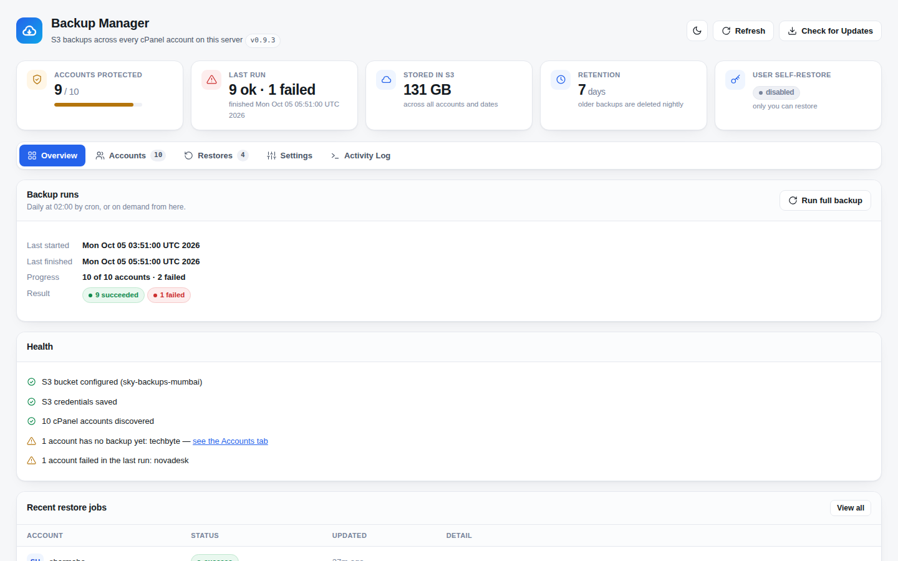
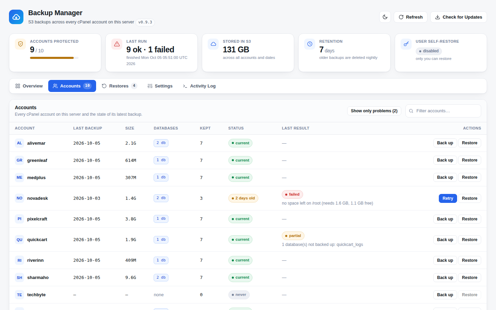
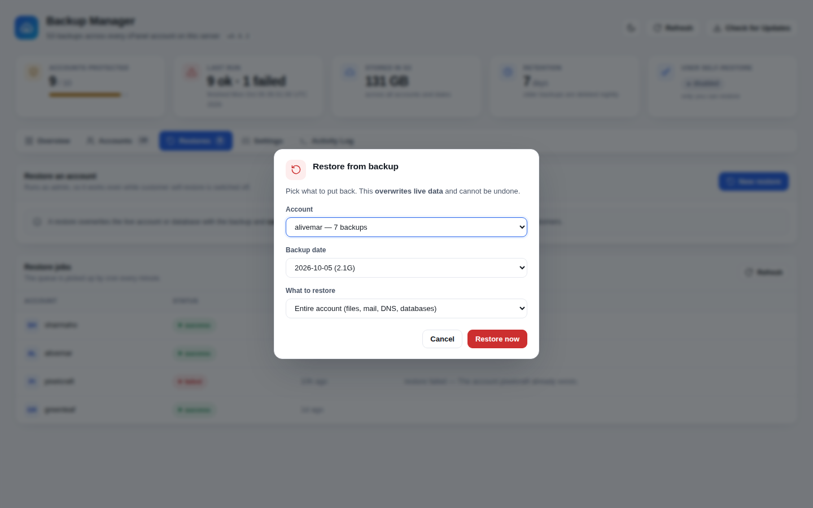
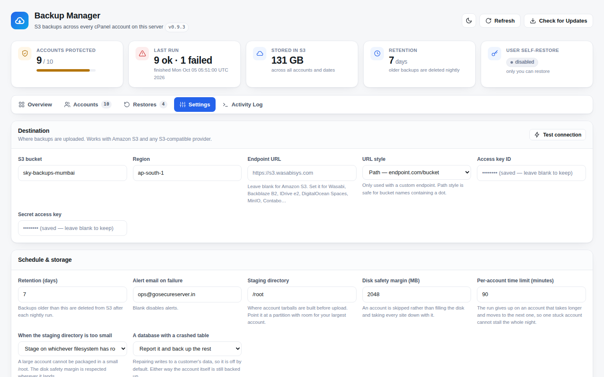
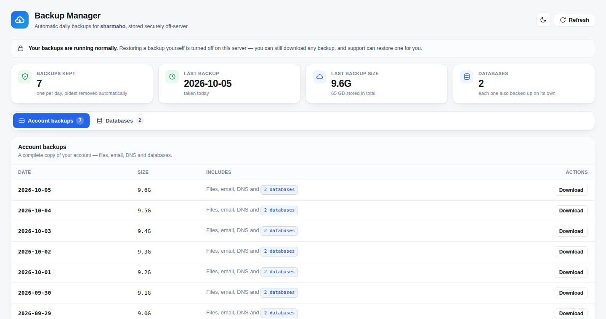
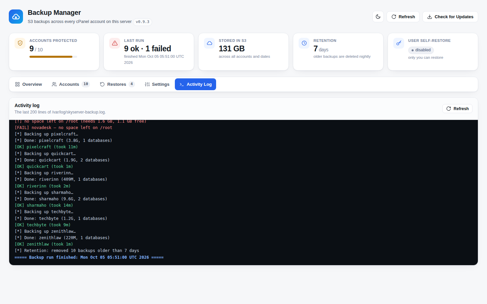
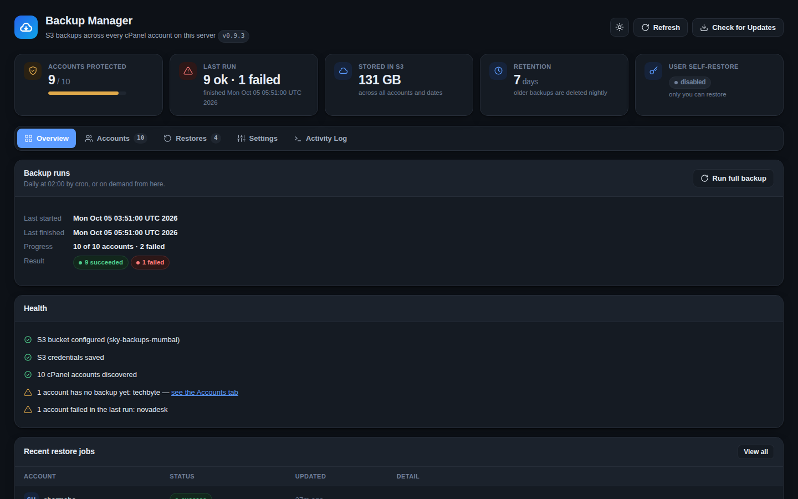

<p align="center">
  
</p>

<p align="center">
  <a href="https://github.com/hdmedianetwork/skyserver_cpanel_backup_module/actions/workflows/ci.yml"></a>
  
  
  
</p>

<p align="center">
  <b>Backup Manager</b> backs up every cPanel account (files, email, DNS and each database) to Amazon S3
  or any S3-compatible storage every night. Admins restore from WHM, and customers download or restore
  their own backups from cPanel.
</p>

<p align="center">
  <a href="#quick-start">Quick start</a> ·
  <a href="#features">Features</a> ·
  <a href="#screenshots">Screenshots</a> ·
  <a href="#configuration">Configuration</a> ·
  <a href="docs/TROUBLESHOOTING.md">Troubleshooting</a> ·
  <a href="docs/ARCHITECTURE.md">Architecture</a> ·
  <a href="SECURITY.md">Security</a>
</p>

---

<p align="center">
  
</p>

## Features

| | |
|---|---|
| **Nightly off-site backups** | Every account is packaged with `pkgacct` and uploaded to S3 at 02:00. Each database is also dumped and uploaded on its own. |
| **Any S3 storage** | Amazon S3, Wasabi, Backblaze B2, IDrive e2, DigitalOcean Spaces, MinIO, Contabo, and more. A built-in connection test checks write access, not just listing. |
| **Verified before upload** | Every tarball is checked with `tar -tzf` and every dump with `gzip -t` before it is uploaded. A backup that won't extract is never stored. |
| **Restore from WHM** | Restore a whole account or a single database from any stored date, behind a two-step confirmation. |
| **Customer self-service** | A **Backup Manager** page in every cPanel account. Customers download any backup through a one-hour private link, and can restore their own if you allow it. |
| **Live progress** | Admins watch a run move account by account (*90 of 187, now on sharmaho*). Customers see real percentages while their backup is packaged, uploaded, fetched or restored. |
| **Survives bad nights** | Per-account time limit, resume after a crash or reboot, retry a single failed account, and a disk-space guard that never fills the server. |
| **Partial, not failed** | A crashed database table no longer costs an account its whole backup. The account is marked *partial*, with the reason shown. |
| **Clear failure reasons** | `no space left on /root` instead of just "failed", on every row, with a **Show only problems** filter. |
| **Retention & alerts** | Old backups are deleted from S3 automatically. A failed night emails you the failed accounts and the log. |
| **One-click updates** | **Check for Updates → Install update** in WHM. Your configuration and existing backups are never touched. |
| **Light & dark theme** | One design system across WHM and cPanel. Nothing loads from a CDN. |

## Screenshots

<table>
  <tr>
    <td width="50%"><br><sub><b>Accounts</b>: latest backup, size, databases and status for every account, with the reason for any failure.</sub></td>
    <td width="50%"><br><sub><b>Restore</b>: account → date → whole account or one database, confirmed twice.</sub></td>
  </tr>
  <tr>
    <td width="50%"><br><sub><b>Settings</b>: destination, retention, safety limits and customer self-restore, with a live S3 test.</sub></td>
    <td width="50%"><br><sub><b>Customer view</b>: cPanel → Files → Backup Manager.</sub></td>
  </tr>
  <tr>
    <td width="50%"><br><sub><b>Activity Log</b>: the backup log, colour-coded, live while a run is going.</sub></td>
    <td width="50%"><br><sub><b>Dark theme</b>, remembered per browser.</sub></td>
  </tr>
</table>

## Requirements

- A cPanel & WHM server with root access
- An S3 bucket and an access key limited to that bucket ([example policy](#s3-permissions))
- Enough free disk to stage your largest account before upload (see `BACKUP_WORK_DIR`)
- `jq` and the AWS CLI. The installer installs both if they are missing.

## Quick start

As **root** on the WHM server:

```bash
curl -sSL https://backup.gosecureserver.in/install.sh | bash
```

Then:

1. Open **WHM → Plugins → SkyServer Backup Manager → Settings**. Enter the bucket, region and access
   keys, then press **Test connection**.
2. On **Accounts**, press **Back up** on one small account and watch the **Activity Log**.
3. Check the result in your bucket. Then let the nightly run take over at 02:00.

Customer self-restore is **off** until you turn it on. See [Rolling out safely](#rolling-out-safely).

<details>
<summary><b>Other ways to install</b></summary>

**Straight from GitHub:**

```bash
curl -sSL https://raw.githubusercontent.com/hdmedianetwork/skyserver_cpanel_backup_module/main/install.sh | bash
```

**Self-contained installer** (every file embedded, nothing fetched at install time). This is
useful for servers that cannot reach GitHub:

```bash
scripts/build-installer.sh        # → dist/install-standalone.sh
```

Upload `dist/install-standalone.sh` to your web server (for example as
`https://backup.gosecureserver.in/install.sh`), and rebuild and re-upload it after every release.
Check that it is served as plain text:

```bash
curl -sSL https://backup.gosecureserver.in/install.sh | head -3   # must start with #!/bin/bash
```
</details>

### What the installer sets up

| | |
|---|---|
| `/opt/skyserver-backup-module` | The module |
| `/etc/skyserver-backup.conf` | Configuration (`0600`, created once, never overwritten) |
| `/etc/cron.d/skyserver-backup` | Nightly backup at 02:00, and the restore queue every minute |
| `/etc/logrotate.d/skyserver-backup` | Weekly rotation of `/var/log/skyserver-backup.log` |
| WHM → Plugins | **SkyServer Backup Manager** (admin dashboard) |
| cPanel → Files | **SkyServer Backup Manager** (customer page, every theme) |

## Configuration

Everything is editable in **WHM → Backup Manager → Settings**, which writes
`/etc/skyserver-backup.conf`. Access keys are never sent back to the browser.

| Setting | Default | Description |
|---|---|---|
| `S3_BUCKET` | — | Destination bucket |
| `AWS_DEFAULT_REGION` | `ap-south-1` | Bucket region |
| `S3_ENDPOINT_URL` | *(empty)* | Empty for Amazon S3. Set it for an S3-compatible provider, e.g. `https://s3.wasabisys.com` |
| `S3_ADDRESSING_STYLE` | automatic | `path` or `virtual`. Path style is chosen automatically for custom endpoints and for bucket names that contain a dot. |
| `AWS_ACCESS_KEY_ID` / `AWS_SECRET_ACCESS_KEY` | — | Keys limited to this bucket |
| `RETENTION_DAYS` | `7` | Backups older than this are deleted from S3 after each run |
| `BACKUP_WORK_DIR` | `/root` | Where account tarballs are staged before upload |
| `BACKUP_WORK_DIR_FALLBACK` | `1` | Stage on another filesystem with room if the work dir is too small |
| `DISK_SAFETY_MARGIN_MB` | `2048` | Skip an account rather than leave less than this free |
| `ACCOUNT_TIMEOUT_MIN` | `90` | Give up on an account that takes longer, and move on |
| `MYSQL_AUTO_REPAIR` | `0` | Run `mysqlcheck --auto-repair` on a crashed table, then retry the dump |
| `ENABLE_USER_RESTORE` | `0` | Let customers restore their own backups |
| `MYSQL_DEFAULTS_FILE` | `/root/.my.cnf` | Root's MySQL credentials |
| `ALERT_EMAIL` | *(empty)* | Receives the failed accounts and the log when a run fails |

### S3 permissions

Use a key that can reach only the backup bucket, never your root AWS account:

```json
{
  "Version": "2012-10-17",
  "Statement": [
    { "Effect": "Allow", "Action": ["s3:ListBucket"], "Resource": "arn:aws:s3:::YOUR-BUCKET" },
    { "Effect": "Allow", "Action": ["s3:PutObject", "s3:GetObject", "s3:DeleteObject"], "Resource": "arn:aws:s3:::YOUR-BUCKET/*" }
  ]
}
```

Backups are stored as:

```
s3://<bucket>/backups/<user>/<YYYY-MM-DD>/full-account.tar.gz
s3://<bucket>/backups/<user>/<YYYY-MM-DD>/databases/<db>.sql.gz
```

## Rolling out safely

A restore overwrites live data. Without a staging server, go in this order:

1. **Install.** Customers can see and download their backups, but cannot restore them.
2. **Back up one small account** from the dashboard and read the Activity Log.
3. **Download that tarball** from S3 and open it (`tar -tzf`) to confirm it holds real data.
4. **Run a full backup**, then let cron run for a few nights, checking the dashboard each morning.
5. **Create a throwaway account** and restore into it to prove the restore path works end to end.
6. Only then turn on **customer self-restore** in Settings.

## Command line

```bash
cd /opt/skyserver-backup-module/bin

./backup-all.sh               # back up every account
./backup-all.sh --resume      # continue an interrupted run; skips accounts already done today
./backup-user.sh <user>       # back up one account
./s3-test.sh                  # check the bucket and credentials
./self-update.sh check|apply  # check for, or install, an update
```

Logs: `/var/log/skyserver-backup.log`, also shown in **Activity Log** in WHM.

## Updating

Press **Check for Updates → Install update** in WHM. That runs `bin/self-update.sh apply`, which
pulls the latest release and runs `bin/deploy.sh` again. Configuration, run state and the backups in
S3 are left untouched.

## Uninstalling

```bash
/opt/skyserver-backup-module/scripts/uninstall.sh
```

This removes the cron jobs, both panels and the module. `/etc/skyserver-backup.conf` and every backup
already in S3 are left in place.

## Security

- **Customers never get S3 credentials or root.** The cPanel page only drops a request file into a
  queue. A root worker validates it against the live account list before doing anything.
- **Self-restore is enforced in three places:** the page hides the buttons, the endpoint rejects
  crafted requests, and the worker checks again before touching data.
- **Customers can't see each other's backups.** Each account's manifest is `0640 root:<user>`, in
  directories that can be traversed but not listed.
- **Downloads use one-hour presigned links.**
- **Every change is POST-only**, behind WHM's and cPanel's session tokens.

Details are in [docs/ARCHITECTURE.md](docs/ARCHITECTURE.md). To report a vulnerability, see
[SECURITY.md](SECURITY.md).

## Troubleshooting

Real problems, their causes and their fixes are collected in
[docs/TROUBLESHOOTING.md](docs/TROUBLESHOOTING.md), including:

- nightly backups that do nothing, or restores that say *unknown user*
- a run that stops on one account
- *Access denied for user 'root'@'localhost'* from `mysqldump`
- a customer page that says *No backups yet* while WHM lists them
- bucket names with a dot in them

## Changelog

See [CHANGELOG.md](CHANGELOG.md).

---

<p align="center">
  <sub>Part of the <b>SkyServer</b> hosting toolkit, alongside
  <a href="https://github.com/hdmedianetwork/cpanel_file_detector">SkyServer Storage Guard</a>.</sub>
</p>
